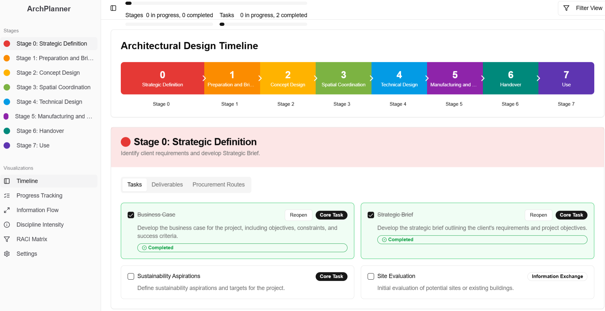

# ArchPlanner

A comprehensive web application for managing architectural projects based on the RIBA Plan of Work 2020 framework.

## Overview

ArchPlanner is a dashboard-oriented ability designed to help architects, designers, and construction professionals visualize, track, and manage projects through all 8 stages of the RIBA Plan of Work 2020. It provides a structured approach to project management while remaining flexible enough to accommodate different procurement routes and project requirements.

## Features

- **Interactive Dashboard**: Visual timeline representation of all 8 RIBA stages
- **Project Management**: Track multiple projects with stage-specific tasks and milestones
- **Document Repository**: Organized storage for all project documentation by stage
- **Strategy Implementation**: Built-in tracking for key project strategies (sustainability, fire safety, etc.)
- **Collaborative Interface**: Share progress and information with team members and clients
- **Responsive Design**: Access your projects from desktop or tablet devices

## Technology Stack

- **Frontend**: React.js with Material-UI components
- **Visualizations**: D3.js for interactive charts and timelines
- **Data Store**: JSON-based storage with optional database integration
- **Deployment**: Static hosting with serverless functions

## Getting Started

### Prerequisites

- Node.js (v16+)
- npm or yarn

### Installation

```bash
# Clone the repository
git clone https://github.com/diegovianagomes/archplanner.git

# Navigate to project directory
cd archplanner

# Install dependencies
npm install

# Start development server
npm start